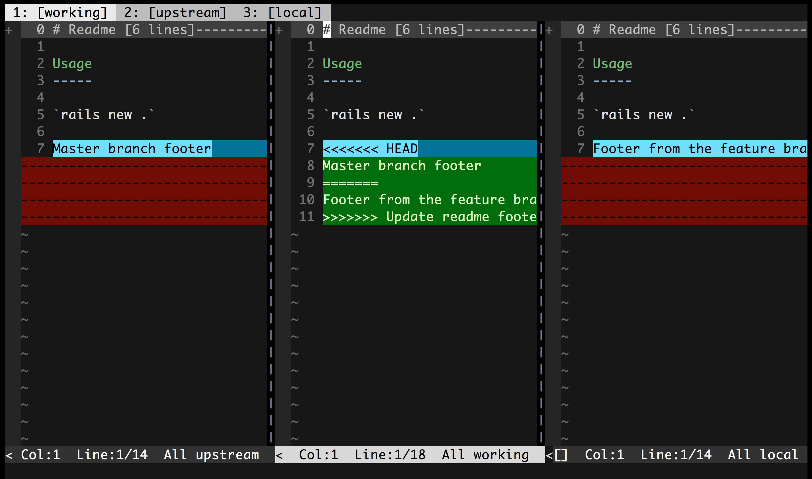
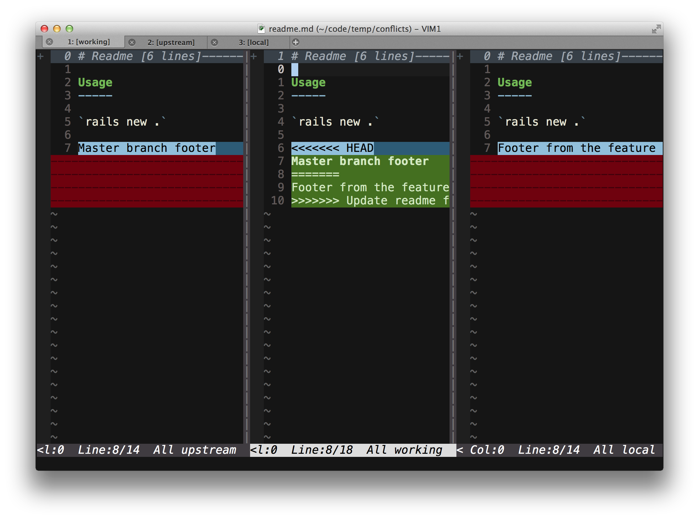
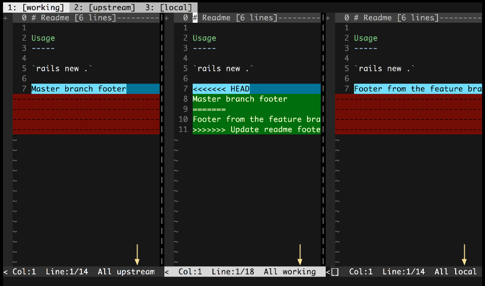
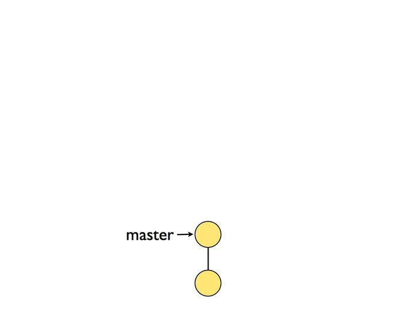
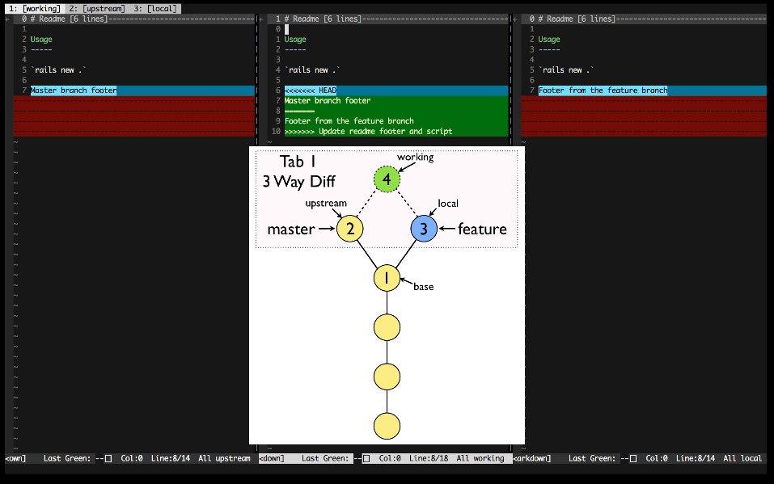
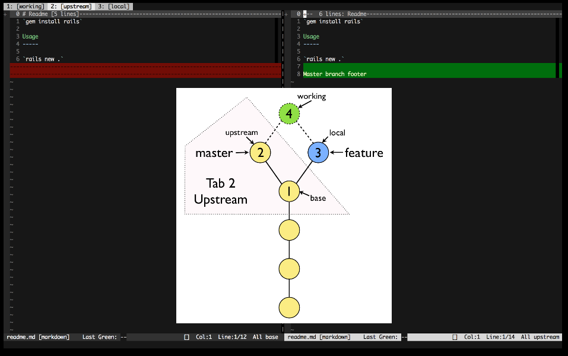
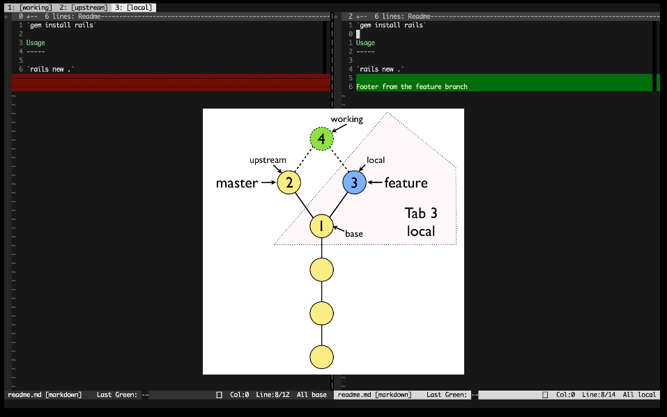

Conflicted
==========

Conflicted is a Vim plugin that aids in resolving git merge and rebase
conflicts. It relies on [tpope's fugitive plugin][] to do the heavy lifting and
provides a few wrapper commands and a streamlined workflow to make resolving
conflicts much more straightforward.

[tpope's fugitive plugin]: https://github.com/tpope/vim-fugitive

Usage
-----

### From git

The easist way to use Conflicted from git is to add an alias for it that opens
vim with the conflicted plugin activated. You can add the alias with the
following shell command:

``` sh
git config --global alias.conflicted '!vim +Conflicted'
```

From there, you can run conflicted directly from git with:

``` sh
git conflicted
```

Which will open Vim and start up the plugin.

### Commands

Conflicted provides three primary commands for working with conflicts:

**Conflicted**

`Conflicted` will add all the conflicted files to Vim's `arglist` and open
the first in `Merger` mode.

**GitNextConflict**

After editing the merged file to resolve the conflict and remove all conflict
markers, running `GitNextConflict` will mark the file as resolved and open
the next file in `Merger` mode for resolution.

If you are on the last file, `GitNextConflict` will quit Vim.

**Merger**

`Merger` will open the various views of the conflicted file. This command is
exposed for completeness, but likely you will not need to call this command
directly as both `Conflicted` and `GitNextConflict` will call it for you.

### Diffget Mappings

Conflicted provides mappings to perform a `diffget` from the working version
of the file, pulling from either the upstream or local version. These mappings
are provided in both normal and visual mode:

1. `dgu` - diffget from the upstream version
1. `dgl` - diffget from the local version

If you would prefer different mappings, you can overide with the following in
your vimrc:

``` vim
" Use `gl` and `gu` rather than the default conflicted diffget mappings
let g:diffget_local_map = 'gl'
let g:diffget_upstream_map = 'gu'
```

### Tabline

Conflicted will configure the tab label to display the name of the revision in
the tab. This is done via the `tabline` setting in terminal Vim, and the
`guitablabel` setting in graphical Vim, ie MacVim.





### Statusline Integration

Add the following to your vimrc to display the version name of each split in
the vim statusbar:

``` vim
set stl+=%{ConflictedVersion()}
```

Normally it will not add anything to the statusline, but if you are in
conflicted mode then it will add the conflicted version, ie 'local',
'working', etc.



Installation
------------

If you don't have a preferred installation method, I recommend using [Vundle][].
Assuming you have Vundle installed and configured, the following steps will
install the plugin:

Add the following line to your `~/.vimrc` and then run `BundleInstall` from
within Vim:

``` vim
" Fugitive is required for Conflicted
Bundle 'tpope/vim-fugitive'
Bundle 'christoomey/vim-conflicted'
```

Overview
--------



### Versions

Conflicted makes reference to four different versions of each conflicted
file. These versions are:

1. `base` - The common ancestor of the file in the upstream and local branches
1. `upstream` - The core branch (usually `master`), that you are merging into
   or rebasing onto.
1. `local` - The feature branch containing your changes
1. `working` - The final combined version of the file

### Tabs

For each conflicted file, Conflicted will open 3 tabs, each with a different
diff view presented:

1. **Gdiff 3-way** - 3 way diff comparing the upstream, working, and local
   versions of the file.



1. **Upstream Changes** - A 2 way diff between the base and upstream versions
   of the file.



1. **Local Changes** - A 2 way diff between the base and local versions of
   the file.



[Vundle]: https://github.com/gmarik/vundle
